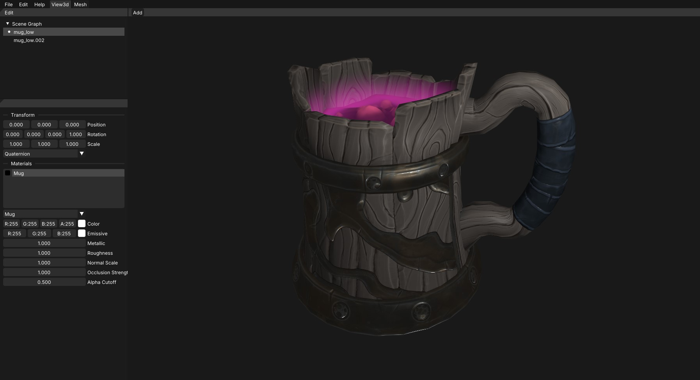

# NRay

## Rendering Engine with Vulkan backend



The goal of this project is to build a foundation for research in high-performance computer graphics with aim on integrating neural networks into existing pipelines.

## Features:

1. Vulkan:
	* Fully automatic resource management with my helper library [vulkan_backend](https://github.com/noir-nik/vulkan_backend)
	* Support for GLSL, Slang and SPIR-V shaders
	* Bindless textures and buffers
	* Graphics pipeline library
	* MSAA
	
2. Engine:
	* Physically-based rendering (PBR) with metallic-roughness pipeline
	* glTF 2.0 scene loading
	* Entity component system based on [EnTT](https://github.com/skypjack/entt)
	* Scene graph
	* Editor

## Requirements

This project targets Vulkan 1.3 and C++20 with plans to remove headers entirely in favour of named modules and the C++23 std module. Currently it compiles successfully with recent releases of GCC, Clang and MSVC.

### Dependencies:
* [EnTT](https://github.com/skypjack/entt)
* [fastgltf](https://github.com/spnda/fastgltf)
* [GLFW](https://github.com/glfw/glfw)
* [ImGui](https://github.com/ocornut/imgui)
* [MikkTSpace](http://www.mikktspace.com)
* [spdlog](https://github.com/gabime/spdlog)
* [stb](https://github.com/nothings/stb)
* [vulkan_backend](https://github.com/noir-nik/vulkan_backend)

## Installation
1. Clone the Repository:

```sh
git clone https://github.com/noir-nik/NRay.git
cd NRay
git submodule update --init --recursive
```

2. Build the Project:
```sh
mkdir build
cd build
cmake ..
cmake --build . -j8
```

3. Render a Scene:
```sh
./NRay <path-to-gltf>
```

You can inspect your scene using Maya-like controls.

## Future plans:
1. Ray Tracing: research of ray tracing acceleration methods including BVH traversal with machine learning.
2.  Differentiable rendering: optimization of materials and textures with the help of [Slang](https://github.com/shader-slang/slang) automatic differentiation.
3. Neural rendering of meshes and volumes and replacing PBR lighting functions with neural networks.

## License

This project is licensed under the MIT License.

---

*Asset used in preview was created by me using industry standard PBR metallic-roughness pipeline*